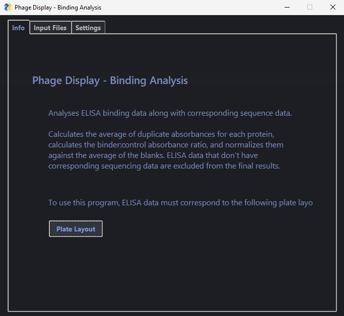
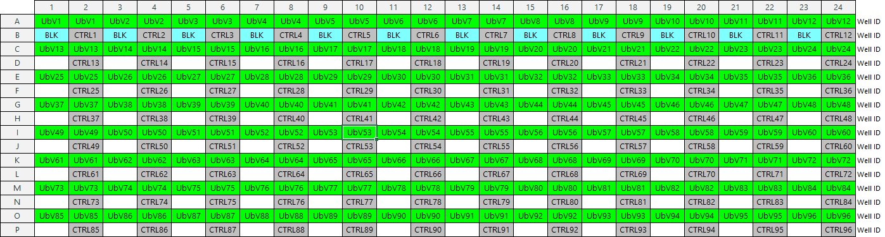

# Binding Analysis
 
Analyses ELISA binding data along with corresponding sequence data.  Calculates the average of duplicate absorbances for
each protein, calculates the binder:control absorbance ratio, and normalizes them against the average of the blanks.
ELISA data that don't have corresponding sequencing data are excluded from the final results.

## Details:

The following ELISA plate layout must be used:

**Input:** ELISA data (xlsx; formatting dependent on the plate reader, please see _/sampleInputs_ for an example), amino
acid alignment data (fasta; generic formatting), and nucleotide alignment data (fasta; generic formatting).

**Output:** Excel file (xlsx) with four worksheets containing all amino acid sequences, unique amino acid sequences,
all nucleotide sequences, and unique nucleotide sequences, respectively. ELISA data is paired with the corresponding
sequences and descriptive statistics (i.e. frequency, maximum/minimum/mean/median/standard deviation, and corresponding
sequence IDs) are generated for each unique sequence.

* Program is dependent on the style of the worksheet used as the ELISA data source. See
_phageDisplay/2_bindingAnalysis/sampleInputs_ to see the desired layout. In summary, data extraction is dependent
upon the emission absorbance stated on the right side of the table of raw data; this is used to determine which data to
extract from the file.  
* Any assumptions that were made in previous code will be retained. If using the output from the Sequencing Analysis
program, the following will apply:

    a) Sequences that are not full length are excluded.

    b) Sequences that have premature stop codons are excluded. 

    c) Sequences with uncalled residues/base pairs (Xs and Ns,
respectively) are included.

## Compatibility:
* PyCharm is the recommended IDE to use for running terminal scripts. If using Spyder, avoid version 5 as this version
for has conflicts with the xlsxwriter package and may get stuck on importing modules.
* Confirmed to work with Python 3.9. Later/earlier versions may work but have not been verified.
* Confirmed to work in Windows and unconfirmed in Macs and Linux. Path names may need to be changed to suit Macs
and Linux' formats.

## Usage:

### GUI/executable

1. Go to _phageDisplayAnalysis/2_bindingAnalysis/gui/executable_ and download the entire folder as a zip file.
2. Extract to _C:\Program Files_ (give administrator permission if necessary).
3. Right click '_gui_bindingAnalysis.exe_' and click 'Create shortcut'. The shortcut will likely relocate to your
desktop.
4. Open the program with the shortcut.
5. The first time the program is run, Windows may try to prevent you from opening the file in order to protect your PC
(see below). Click on 'More info' and then click on 'Run anyway'. Once you've done this once, it won't ask again.

###### Image credit to [monstersocial.net](https://monstersocial.net/).

Note: Only do this for trusted sources. Be very careful about opening executables sent by strangers and make sure to do
your due diligence and carefully examine all sources online.

### Terminal

1. Go to _phageDisplayAnalysis/2_bindingAnalysis/terminal/_ and download '_terminal_bindingAnalysis.py_'.
2. Run in IDE of choice (PyCharm recommended).
3. Follow the prompts.
