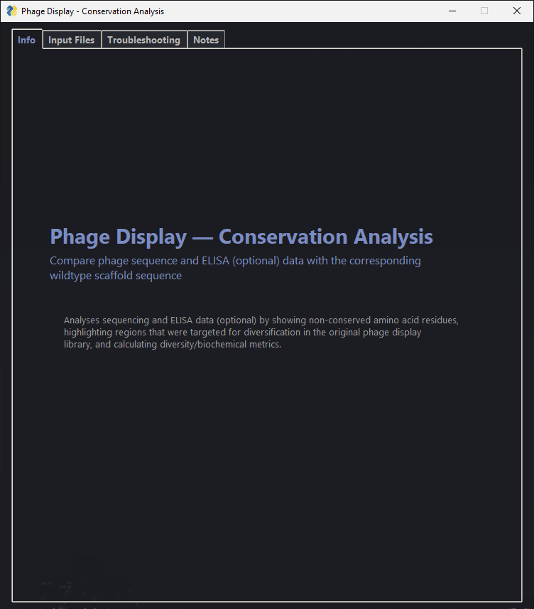

# Conservation Analysis
 
Analyses phage display ELISA and/or sequencing data by showing only non-conserved amino acid residues, highlighting regions that
were targeted for diversification in the original phage display library, and calculating diversity and biochemistry
metrics.

## Details:

**Input:** ELISA data (\*.xlsx; formatted same as Binding Analysis output) or amino acid alignment data (\*.fasta; generic
formatting).

**Output:** Excel file (\*.xlsx) with one worksheet containing the conserved amino acid alignment of unique sequences,
frequency of each sequence, corresponding UbV IDs, and with/without statistical data depending on whether the input file
was ELISA data or amino acid alignment data, respectively.

* Program is dependent on the style of the worksheet used as the ELISA data source. See
_phageDisplay/3_conservationAnalysis/sampleInputs_ to see the desired layout. In summary, data extraction is dependent
upon the emission absorbance stated on the right side of the table of raw data; this is used to determine which data to
extract from the file. 
* Any assumptions that were made in previous code will be retained. When using the output from the Sequencing/Binding
Analysis programs, the following will apply:

    a) Sequences that are not full length are excluded.

    b) Sequences that have premature stop codons are excluded. 

    c) Sequences with uncalled residues/base pairs (Xs and Ns, respectively) are included.

## Compatibility:
* PyCharm is the recommended IDE to use for running terminal scripts. If using Spyder, avoid version 5 as this version
for has conflicts with the xlsxwriter package and may get stuck on importing modules.
* Confirmed to work with Python 3.9. Later/earlier versions may work but have not been tested.
* Confirmed to work in Windows and unconfirmed in Macs and Linux. Path names may need to be changed to suit Macs
and Linux' formats.

## Usage:

### GUI/executable

1. Go to _phageDisplayAnalysis/3_conservationAnalysis/gui/executable_ and download the entire folder as a zip file.
2. Extract to _C:\Program Files_ (give administrator permission if necessary).
3. Right click '_gui_conservationAnalysis.exe_' and click 'Create shortcut'. The shortcut will likely relocate to your
desktop.
4. Open the program with the shortcut.
5. The first time the program is run, Windows may try to prevent you from opening the file in order to protect your PC
(see below). Click on 'More info' and then click on 'Run anyway'. Once you've done this once, it won't ask again.

###### Image credit to [monstersocial.net](https://monstersocial.net/).

Note: Only do this for trusted sources. Be very careful about opening executables sent by strangers and make sure to do
your due diligence and carefully examine all sources online.

### Terminal

1. Go to _phageDisplayAnalysis/3_conservationAnalysis/terminal/_ and download '_terminal_conservationAnalysis.py_'.
2. Run in IDE of choice (PyCharm recommended).
3. Follow the prompts.
