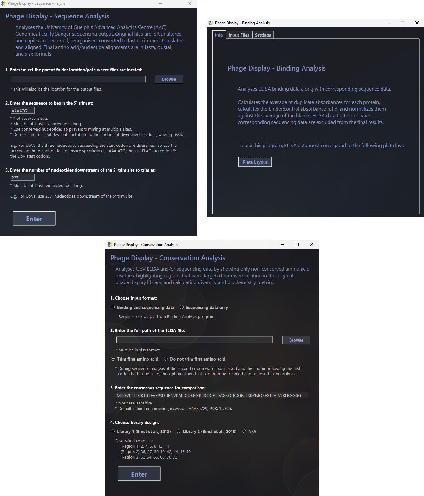

# Phage Display Analysis

This Phage Display Analysis repository is a collection of programs made for analysing large datasets from phage display experiment. Specifically, these are optimised for analysing sequencing data returned by the University of Guelph's Advanced Analytics Centre (AAC) and for analysing the outputs of the program used prior to it. 

In order of suggested use, the set of programs includes:

1. Sequence Analysis
2. Binding Analysis
3. Conservation Analysis

Each program can be run either as an executable or a terminal program. For further details on each program (e.g. how to run, input/ouput file types, and so on), please look at their respective reademe's in their folders.

###### GUIs for each program.

## Compatibility:
* PyCharm is the recommended IDE to use for running terminal scripts. If using Spyder, avoid version 5 as this version
for has conflicts with the xlsxwriter package and may get stuck on importing modules.
* Confirmed to work with Python 3.9. Later/earlier versions may work but have not been tested.
* Confirmed to work in Windows and unconfirmed in Macs and Linux. Path names may need to be changed to suit Macs
and Linux' formats.

## Updates

I try to update these regularly as I discover more bugs. It is unrealistic to expect these programs to be fool-proof but I try to make them as close as possible to it.

## Issues & Requests

If you experience any issues running the program, please either create an issue in GitHub or email me directly at oroscow@uoguelph.ca.

Additionally, if these programs don't work for your data set but you would like a program that does, please send me an email and run your idea past me. We can discuss whether you want a similar program or something new altogether (don't be afraid to challenge me either)!
